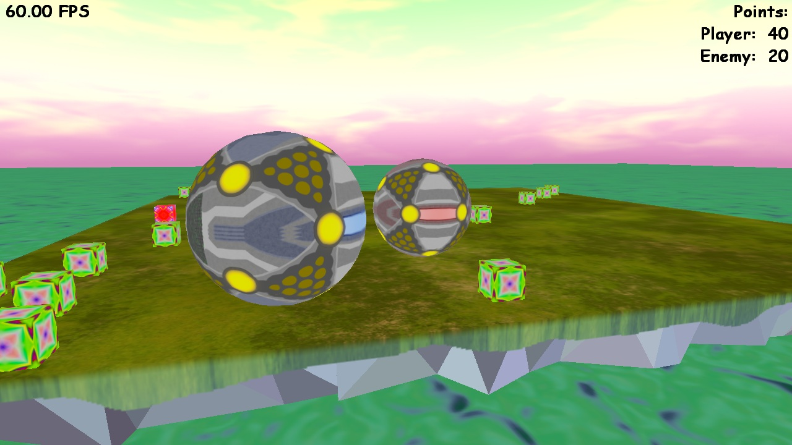



# Sphere Duel Game

This project started as a university assignment and was later improved with additional features.

## Overview

This game is set on an island where spheres can move around and collect cubes.
Each cube increases the sphere’s score.
Every time a sphere receives a certain amount of points it grows a bit,
pushing away everything in close proximity.

Some cubes are special “hyper” cubes. 
When a sphere collects one, it attracts nearby cubes for a limited time.

In the original version spheres can also eat each other 
if their size difference is significant enough.
Otherwise they push each other away when they collide.

## Features

* Extendible architecture
* Sophisticated physics
* "AI" bots
* Custom 3D models
* High resolution textures
* Multiple different camera controls
* Advanced error detection and reporting
* Fixed FPS

## Repository structure (Branches)

* `main` contains the original implementation of the game 
  as well as more recent improvements to core game mechanics.
* `ai-arena` is an alternative game with more advanced "AI" bots 
  competing against each other in a similar setting.

## Getting started

1. Install DirectX SDK
2. Install TL-Engine *
3. Clone the repository
4. Open [SphereDuelGame.sln](SphereDuelGame.sln) in Visual Studio
5. Compile and run

## Requirements

* OS: Windows 8+ (11 is recommended)
* DirectX: [9.29.1962.1](https://www.microsoft.com/en-gb/download/details.aspx?id=6812)
* TL-Engine: 2.30 Beta6
* Visual Studio: 2019+ (2022 is recommended)

## License

The code is licensed under BSD 3-Clause.

See [LICENSE.txt](LICENSE.txt) for full license text.

&nbsp;

Media is licensed under CC-BY-4.0.

See [Media/LICENSE.txt](Media/LICENSE.txt) for full license text.

See [Media/ATTRIBUTION.txt](Media/ATTRIBUTION.txt) for additional attribution information.